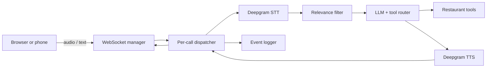

# Bitewiz — real-time voice ordering assistant

Bitewiz is a voice-first restaurant discovery and ordering prototype. It accepts live audio or text over WebSockets, transcribes speech, filters ambient conversation, streams an LLM response, executes allow-listed restaurant tools, and synthesizes the response back to audio.

The core engineering problem is orchestration: five long-lived asynchronous components share one call ID, exchange typed events, and shut down together when the caller disconnects.

## Architecture



Every connection receives a UUID. `Dispatcher` scopes channels by UUID and event type so concurrent calls do not share transcripts, tool output, audio, or timing events.

## Engineering surface

- FastAPI and WebSocket connection lifecycle
- Concurrent STT, LLM, TTS, socket, and logging tasks
- Streaming model output and structured tool calls
- Explicit JSON tool schemas and an implementation allow-list
- Bounded recent-message context and deterministic relevance filtering
- Multilingual prompting and client-selectable audio encoding
- Browser client for live interaction and structured tool results

This repository is a prototype. Restaurant/menu tools use demonstration data and order persistence is local; it is not a production payment or fulfillment system.

## Run locally

Requires Python 3.10+, OpenAI credentials, and Deepgram credentials.

```bash
python -m venv .venv
source .venv/bin/activate
pip install -r requirements.txt
uvicorn app:app --reload --port 8000
```

Environment variables:

```dotenv
OPENAI_API_KEY=...
DEEPGRAM_API_KEY=...
PORT=8000
```

Then open `http://localhost:8000`.

## Agent-assisted engineering setup

This project includes repository-native context for planning, delegating, and reviewing bounded changes:

- [`AGENTS.md`](AGENTS.md) — shared invariants and workflow for coding agents
- [`CLAUDE.md`](CLAUDE.md) — Claude Code entrypoint importing the shared instructions
- [`.agent/PLANS.md`](.agent/PLANS.md) — living-plan contract for substantial changes
- [`.claude/agents`](.claude/agents) — read-only investigator, voice-pipeline implementer, and reviewer
- [`.claude/skills`](.claude/skills) — `/plan-change`, `/trace-call`, `/review-change`, and `/ship-change`
- [`plans/0001-add-agent-operating-layer.md`](plans/0001-add-agent-operating-layer.md) — the first truthful execution record for this setup

These files were added during repository hardening in September 2026. They do not imply that earlier commits used this exact workflow. Model instructions guide behavior; human review remains the approval boundary.

For the reusable orchestration system behind these conventions, see [`agentic-dev-orchestrator`](https://github.com/ByteBoyy/agentic-dev-orchestrator) after publication.

## Repository map

```text
app.py                       FastAPI routes and call task assembly
lib_socket_handler/          client I/O and disconnect handling
lib_stt/                     streaming transcription adapter
lib_llm/                     relevance gate, model stream, and tool routing
lib_tts/                     speech synthesis adapter
lib_infrastructure/          event dispatcher and timing logger
public/ + templates/         browser client
```

## Production boundary

- The in-memory dispatcher is single-process.
- External service failure and cancellation paths need deeper hardening.
- Tool turns are not yet protected by a strict maximum depth.
- Authentication, rate limiting, durable persistence, and distributed tracing are outside this prototype.

## Author

Built by **Omar Ashraf** as an applied voice and LLM system.
